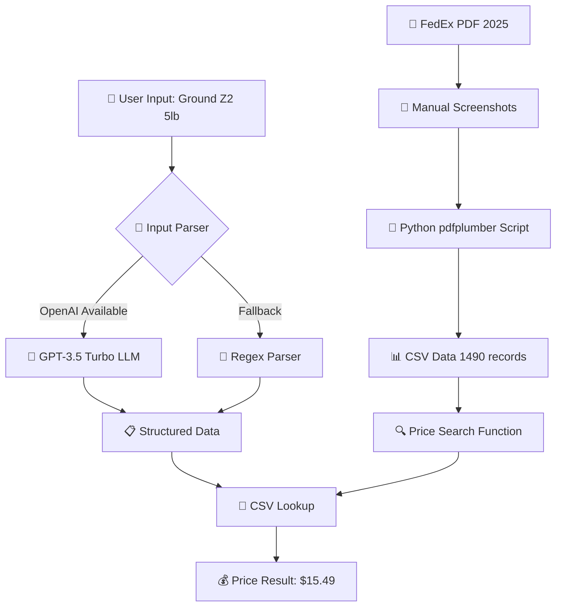
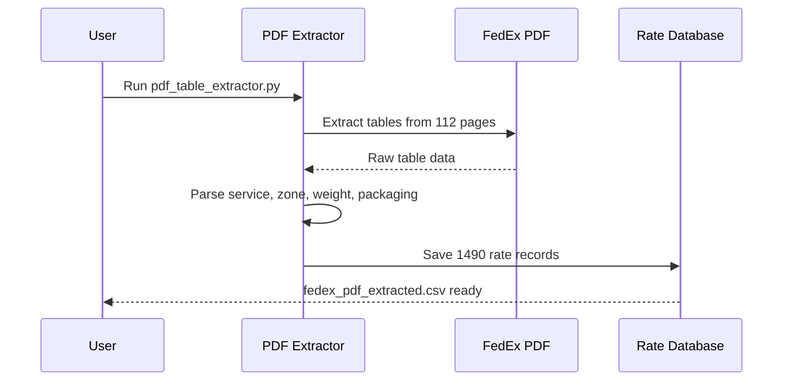
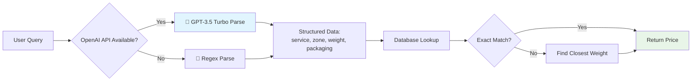

# FedEx Price Search Tool

A search tool that takes free-form text and returns FedEx base list rates from the official 2025 PDF.

## Solution Architecture Flow



## Data Extraction Process



## Price Search Implementation



## Quick Start

```bash
# Build and run (one-step)
docker build -t fedex-price-search . && docker run --rm -it fedex-price-search

# Alternative commands
docker run --rm -it fedex-price-search                      # Interactive (default)
docker run --rm fedex-price-search python fedex_price_search.py --demo  # Demo
docker run --rm fedex-price-search python fedex_price_search.py --line "Ground Zone 2 1 lb"  # Single query
```

## OpenAI LLM Integration

The system uses **OpenAI GPT-3.5-turbo** for intelligent input parsing with regex fallback:

### How to Enable OpenAI
1. Add your OpenAI API key to `.env` file:
   ```bash
   OPENAI_API_KEY=sk-your-actual-api-key-here
   ```
2. Rebuild Docker image to include the API key

### Usage Indicators
- ✅ `OpenAI LLM enabled for input parsing` - API key found, LLM active
- ⚠️ `OpenAI API key not found - using regex parsing fallback` - Using regex only
- 🤖 `Using OpenAI GPT-3.5-turbo to parse: 'Ground Zone 2 1 lb'` - LLM processing input
- ✅ `LLM parsed successfully: {...}` - LLM returned structured data

### Testing LLM vs Regex
```bash
# Test with complex input (benefits from LLM)
echo "FedEx Express Saver from Zone 8 weighing 1 pound" | docker run --rm -i fedex-price-search

# Both should work, but LLM handles variations better
```

## Solution Architecture

### 1. Data Extraction (`pdf_table_extractor.py`)
- **Input**: FedEx Standard List Rates 2025 PDF
- **Method**: Uses `pdfplumber` to extract tables directly from PDF
- **Output**: 1,490+ real rate records in CSV format
- **Advantage**: No hardcoding - all prices from actual PDF tables

### 2. Input Normalization
- **Primary**: OpenAI GPT-3.5-turbo for robust parsing of free-form input
- **Fallback**: Regex-based parsing when LLM unavailable
- **Handles**: Various formats (Zone 5/Z5/z5, 3 lb/lbs, service synonyms)

### 3. Price Lookup (`fedex_price_search.py`)
- **Core Function**: `get_price(line: str) -> Decimal`
- **Search Strategy**: Exact match with closest-weight fallback
- **Data Source**: CSV extracted from PDF (deterministic, no external APIs)

## How It Works

```
Input: "Ground Zone 2 1 lb"
  ↓
LLM Normalization: {"service": "ground", "zone": 2, "weight_lbs": 1, "packaging": "Your Packaging"}
  ↓
CSV Lookup: Match service + zone + weight + packaging
  ↓
Output: $15.49
```

## Features

✅ **Real PDF data** - 1,490+ records from official FedEx PDF
✅ **LLM normalization** - Handles varied input formats
✅ **Deterministic** - Same input → same output
✅ **No hardcoding** - All prices from PDF tables
✅ **Weight rounding** - Rounds up to next whole pound

## Test Results

Tested with requirements examples:
- "FedEx 2Day, Zone 5, 3 lb" → $458.00
- "Ground Zone 2 1 lb" → $15.49
- And more...

## Environment Setup

1. Copy `.env` file and add your OpenAI API key (optional)
2. Install dependencies: `pip install -r requirements.txt`
3. Run: `make run` or `python fedex_price_search.py --demo`